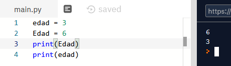
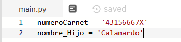
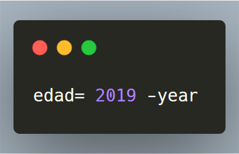
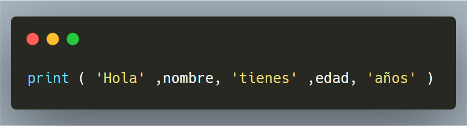
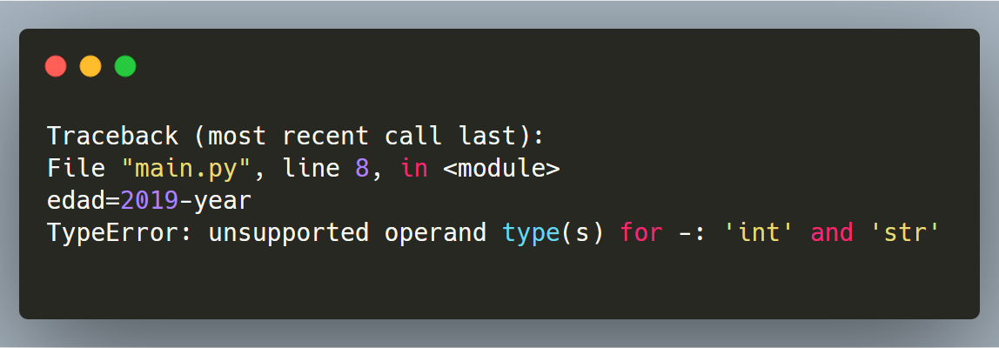
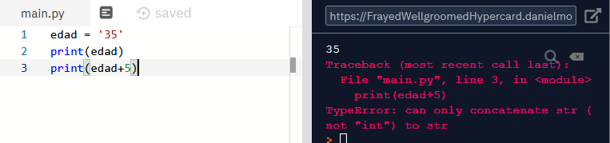
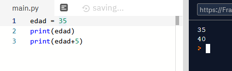

# Variables

En Python, una **variable** es un nombre que se asigna a un valor. Esto significa que cuando creamos una variable, estamos creando un nombre para un valor específico.

La **asignación** de variables nos permite reutilizar ese valor sin tener que escribirlo repetidamente.

Por ejemplo, supongamos que queremos guardar el número 5 en una variable llamada "num". Podemos hacer esto de la siguiente manera:

```python
num = 5
```

Ahora, cada vez que necesitemos usar el número 5, podemos simplemente usar el nombre de la variable "num" en lugar de tener que escribir 5. Esto nos ahorra tiempo y nos permite reutilizar los valores con mayor facilidad.

Por ejemplo, podemos sumar el número 5 a otro número y guardar

## Tipos de variables

### Enteros

Un ejemplo de variable entera es:

```python
edad = 20
```

### Flotantes

Un ejemplo de variable flotante es:

```python
altura = 1.75
```

### Cadenas

Un ejemplo de variable cadena es:

```python
nombre = "Juan"
```

### Booleanos

Un ejemplo de variable booleano es:

```python
es_mayor_de_edad = True
```

Según cómo escribimos las cosas, Python interpreta si esa variable contiene un número, una letra, un decimal, una palabra, etc. En nuestro ejemplo, la variable nombre era de tipo string.

## ¿Cómo podemos llamar a nuestras variables?

Existen ciertas reglas a la hora de poner un nombre a una vriable.

La primera es que no podemos usar palabras del propio lenguaje de programación (print, input… no son nombres de variables permitidos). Se llaman palabras reservadas.

Por tanto, esto es incorrecto:

```python
print = 4
```

El nombre debe consistir en una sola palabra. Esto sería incorrecto:

```python
edad usuario = 10
```
En su lugar, mejor usar guiones o camelcase:

```python
edad_usuario = 10
edadUsuario = 20
```

Además de estas reglas, sólo pueden contener letras, números y el guion bajo. Tampoco pueden empezar con un número

## Mayúsculas y minúsculas

Aunque se pueden usar mayúsculas, y Python es muy cuidadoso con eso, entendiendo que Nombre, NOMBRE y nombre son variables DISTINTAS, lo mejor que podemos hacer es no liarnos siguiendo ciertas recomendaciones.

Fijaos en el ejemplo:



También es típico empezar con minúsculas, como hicimos en nombre. Y usar alguno de estos dos estilos para separar palabras:



Consejos

Los acentos suelen dar problemas por lo que mejor evitarlo.

Para la ñ hay quien para no escribir año usa anio , o bien, anyo .

En programas elaborados es muy conveniente elegir nombres de variables que nos den una pista de qué están representando

## Ejemplo nombre y edad

Vamos a hacer un programa que pida al usuario su nombre y año de nacimiento para decirle al final:

Hola, Paco, tienes 45 años.

Para pedirle el nombre y el año de nacimiento usamos la misma estructura que antes. Una línea con un PRINT para que sepan lo que queremos y otra línea con un INPUT para recoger lo que nos han dicho.

Todas las líneas que pongo aquí las tienes que escribir unas debajo de las otras en el mismo ejercicio. Va todo junto.

```python
print('¿Cómo te llamas')
nombre = input()
print('¿En qué año naciste?')
year = input()
```

Estupendo. Ahora cómo calculamos la edad. Bueno, pues sabemos que la edad será el año actual menos el año de nacimiento.

Pero fíjate, esa resta nos da un valor, que es justo lo que queremos, pero que…

```python
edad = 2022 - anyo
```



## Cálculos con variables

El siguiente paso será calcular nuestra edad.

Con esto creamos la variable edad y le ASIGNAMOS el valor de la resta entre el año 2019 y el valor que tenga la variable year , que nos acaba de dar el usuario, y QUE SERÁ DISTINTO EN CADA EJECUCIÓN.

Pintar información por pantalla



Escribe y ejecuta el código anterior junto y adjunta una captura de pantalla. Te dará error, pero es normal. Luego lo arreglaremos

## Arreglar errores

Al ejecutar el programa veremos que nos aparece en rojo un error. LOS ERRORES SON NORMALES. Leamos el mensaje de error.



La línea 8 es donde yo tengo escrita la operación edad= 2019 -year. En la última línea me dice que el operador “menos” no puede trabajar con un tipo entero y un tipo string a la vez.

El asunto es que TODAS LAS ENTRADAS POR TECLADO se toman como CADENAS DE CARACTERES.

Así que el año que introdujo el usuario, para Python son LETRAS (caracteres), y no sabe cómo restar letras y números.

## Convertir letras en números

Las variables pueden ser de diferentes tipos, y podemos transformar una variable de un tipo en otro. En este caso es necesario,puesto que para hacer operaciones matemáticas hay que convertir las letras en números.

¿Hay una manera en Python de tomarse 45 como si fuera un número o como si fuera una cadena de caracteres? Sí.

Hay que usar la función ``int()``. Convierte, si se puede, una cadena de caracteres en un número entero. Veamos el siguiente ejemplo. Edad contiene un string, es decir, las “letras” 3 y 5. Por eso va entre comillas. Cuando queremos sumar una palabra y un número no podemos (no es posible). Los dos objetos a sumar deben ser números o floats (decimales), por eso falla.



En este otro caso, veréis que la variable edad no lleva comillas. Ahora está guardando 35 como número, no como palabra. Por ello, cuando quiero sumar la variable edad y el número 5, al ser ambos números, funciona.



## Convertir tipos de variables

Cambiar de un tipo a otro se llama **casting**. Si queremos hacer una operación y necesitamos convertir una variable de un tipo a otro, podemos utilizar unas funciones que los transforman.

```python
nombre = input("como te llamas: ")
edad = int(input("que edad tienes: ")
print ('Hola', nombre, 'tienes', edad, 'años')
```


Actividad. Modifica el código anterior para que calcule el año en que te vas a jubilar (supuestamente) a partir de tu edad. Piensa que hoy en día la edad de jubilación es 65. En mi caso, yo le escribiré 35 años con el teclado y el me dirá que me quedan 30 años para la jubilación. Adjunta una captura

Actividad 4. Escribe un programa en que dados dos números (el día de mes de tu cumpleaños y el número de personas que viven en tu casa), muestre:

- El cociente entero (sin decimales)
- El resto
- La división exacta
- La potencia del primer número elevado al segundo
