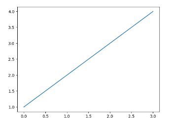

# Bibliotecas en Python

Las bibliotecas de Python son recursos de código que se pueden utilizar para realizar tareas específicas. Estas bibliotecas de código se almacenan en un directorio llamado "librería". Esta guía le ayudará a aprender cómo usar estas bibliotecas para realizar tareas en Python.

## ¿Qué son las bibliotecas?

Una **biblioteca** es una colección de archivos de código que pueden ser usados ​​para realizar tareas específicas. Estas bibliotecas contienen código que se ha escrito con antelación para hacer que sea fácil realizar ciertas tareas. Por ejemplo, una biblioteca puede contener código que le permite crear gráficos o leer archivos de datos.

## Instalación de una biblioteca

Para usar una biblioteca, primero debe **instalarla**. La forma de instalar una biblioteca depende de la biblioteca en particular. Algunas bibliotecas se pueden instalar utilizando el gestor de paquetes de Python, **pip**. Otras bibliotecas se pueden instalar descargando el código fuente y compilándolo.

## Cargar una biblioteca

Una vez que haya instalado una biblioteca, debe cargarla antes de poder usarla. Esto se hace utilizando la función de Python `import`. Por ejemplo, para cargar la biblioteca `matplotlib`, puede usar el siguiente código:

```python
import matplotlib
```

## Usar una biblioteca

Una vez que haya cargado una biblioteca, puede usar el código incluido en dicha biblioteca para realizar tareas. Dependiendo de la biblioteca, esto puede implicar la creación de objetos, la llamada a funciones o el uso de clases. Por ejemplo, la biblioteca `matplotlib` contiene una clase llamada `pyplot` que le permite crear gráficos. Para usar esta clase, primero debe importarla:

```python
from matplotlib import pyplot
```

Una vez que la haya importado, puede usar la clase para crear gráficos usando el siguiente código:

```python
pyplot.plot([1, 2, 3, 4])
pyplot.show()
```

Se nos mostrará la siguiente figura:



## Ejercicio
