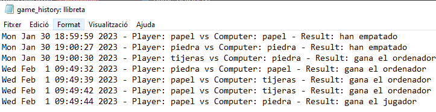

# Piedra papel o tijera

## Fases del juego

1. Jugador 1 elige
2. Ordenador elige
3. Decidir ganador
4. Jugar otra partida (opcional)
5. Guardar partidas en fichero (opcional)

## 1. Elección del jugador

En primer lugar, deberemos pedir al jugador que elija piedra,papel o tijeras

```python
print("Vamos a jugar piedra, papel o tijeras!")
jugador = input("Elige piedra, papel o tijeras: ").lower()
```

El resultado por pantalla:

```
Z:\apuntes>piedra_papel_tijera.py
Vamos a jugar piedra, papel o tijeras!
Elige piedra, papel o tijeras: piedra
```

## 2. Elección del ordenador

A continuación, podemos hacer que el ordenador elija aleatoriamente una de las opciones:

```python
ordenador = random.choice(["piedra", "papel", "tijeras"])
print(f"El ordenador eligió {ordenador}.")
```

Para poder utilizar la función ``random.choice``, debemos importar al comienzo del archivo el módulo ``random``.

```python
import random
```

## 3. Decisión de ganador

Existen 9 combinaciones posibles de resultados, por lo que, en cada uno de ellos, deberemos decidir el ganador, teniendo en cuenta que:

- **Piedra** gana a **tijeras**
- **Tijeras** gana a **papel**
- **Papel** gana a **piedra**

Existen 9 combinaciones posibles:


A continuación deberíamos calcular quien gana la partida:

```python
    if jugador == ordenador:
        print("Empate!")
        resultado = "han empatado"
    elif jugador == "piedra" and ordenador == "tijeras" or \
            jugador == "papel" and ordenador == "piedra" or \
            jugador == "tijeras" and ordenador == "papel":
        print("Ganaste!")
        resultado = "gana el jugador"
    else:
        print("Perdiste!")
        resultado = "gana el ordenador"
```

## 4. Jugar otra partida (opcional)

Para poder volver a jugar o no, tendremos que pedir al jugador, al final de la partida, si quiere o no seguir jugando.

Para ello podemos poner todo el código del juego en una función llamada ``jugar_partida()``, a la que llamaremos en caso de decir que queremos volver a jugar.

```python
    if input("¿Quieres jugar de nuevo? (s/n) ").lower() == "s":
        jugar_partida()
    else:
        print("Gracias por jugar!")
```

## 5. Guardar las partidas en un archivo de texto (opcional)

De forma opcional, podríamos guardar los resultados de la partida en un archivo de texto.

```python
    with open("partidas.txt", "a") as f:
        f.write(
            f"{time.ctime()} - Player: {jugador} vs Computer: {ordenador} - Result: {resultado}\n")
```

Aquí podéis ver cómo quedaría guardada la información. Cada línea representa una partida diferente.


