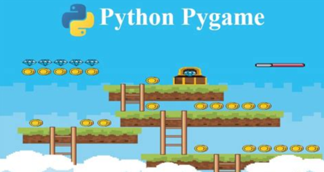
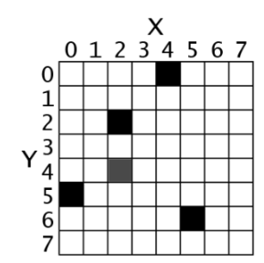
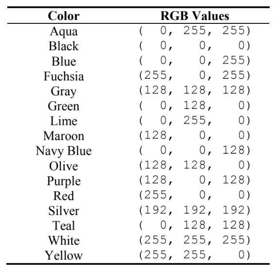

[🔙 Enrere](../) | [🏠 Pàgina principal](http://danimrprofe.github.io/apuntes/) \n\n---
title: Pygame
footer: Daniel Moreno 🌐 <github.com/danimrprofe>
_footer: ""
paginate: true
_paginate: false
_class: invert
marp: true
---

# Pygame

---

En este tema, aprenderemos a crear pequeños juegos en Python utilizando una librería llamada Pygame (Pygame.org), que nos permitirá crear gráficos y manipularlos.

- Librería Pygame
- Ventanas
- Objetos
- Interacción con el teclado
- Colisiones
- Sonido

---

# Ejemplo de programa



---

# Coordenadas de pixels



---

# Colores



---

# Ejemplo (parte 1)

```py

import pygame

# Initialize Pygame
pygame.init()

# Set up the window
win_width = 640
win_height = 480
win = pygame.display.set_mode((win_width, win_height))
pygame.display.set_caption("My Pygame Program")

```

---

# Ejemplo (parte 2)

```py
# Set up the circle
circle_color = (0, 0, 255)  ---

# Blue
circle_radius = 50
circle_pos = (win_width // 2, win_height // 2)

```

---

# Ejemplo (parte 3)

```py
# Game loop
running = True
while running:
    ---

# Handle events
    for event in pygame.event.get():
        if event.type == pygame.QUIT:
            running = False

# Draw the circle
    win.fill((255, 255, 255))  ---

# Fill the window with white
    pygame.draw.circle(win, circle_color, circle_pos, circle_radius)

    # Update the display
    pygame.display.update()

# Quit Pygame
pygame.quit()

```

---

# Pelota que se mueve

```py
import pygame

pygame.init()

ancho_ventana = 300
alto_ventana = 300

color_pelota = (255,0,0)
posicion_pelota = [150,150]
radio_pelota = 50

ventana = pygame.display.set_mode((ancho_ventana,alto_ventana))
pygame.display.set_caption("buenos días")

reloj = pygame.time.Clock()

velocidad_pelota =[2,2]

while True:

  posicion_pelota[0] += velocidad_pelota[0]
  posicion_pelota[1] += velocidad_pelota[1]

  ventana.fill((255,255,255))
  pygame.draw.circle(ventana,color_pelota, posicion_pelota,radio_pelota)

  pygame.display.update()

  reloj.tick(60)
```